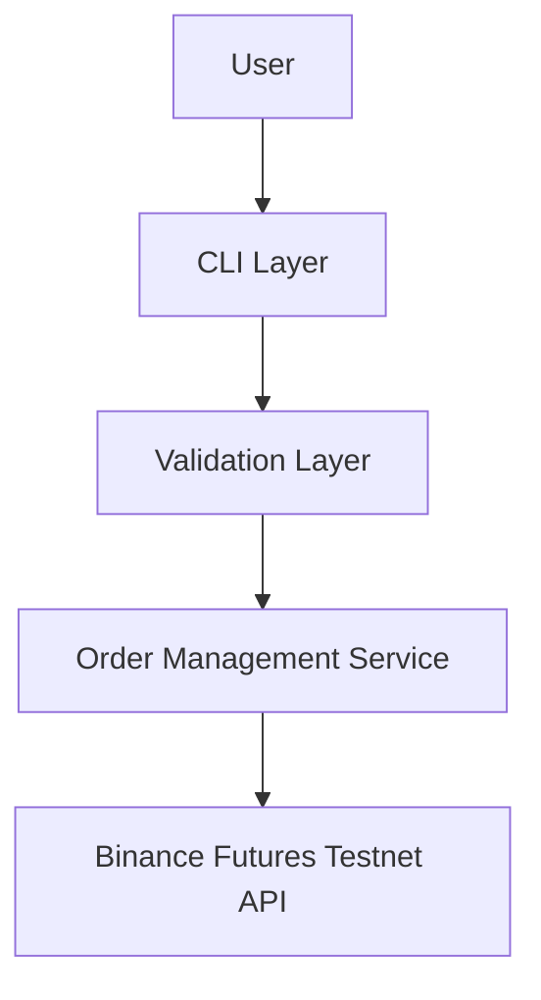
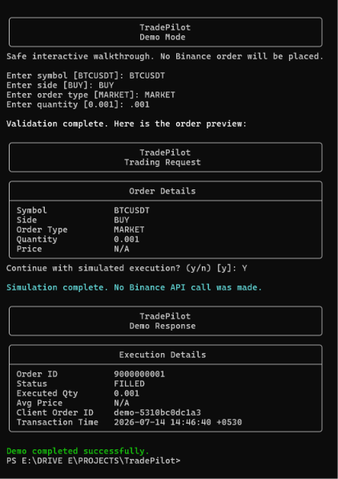
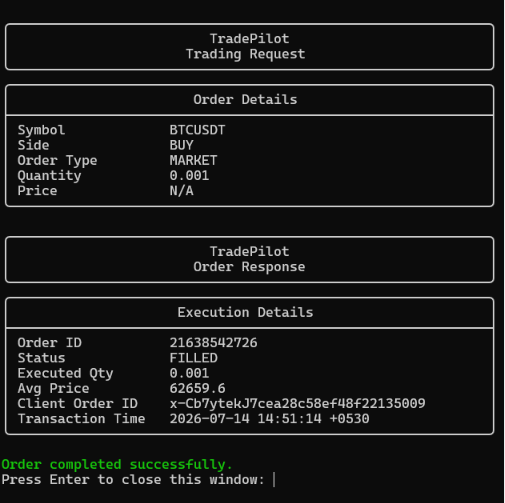

# TradePilot


TradePilot is a CLI-based Binance USDT-M Futures Testnet trading bot built with a clean Python backend structure. It focuses on a small, production-style core: validated order entry, isolated API access, structured logging, and a concise terminal experience. A safe `--demo` mode is included for walkthroughs without placing orders.

## Project Overview

TradePilot places `MARKET` and `LIMIT` orders on the Binance USDT-M Futures Testnet through a lightweight command-line interface. After each submission, the bot performs a follow-up order lookup so the CLI can show Binance's latest snapshot for that order. The same UI can also run in demo mode for safe recruiter review.

## Technology Stack

- Python 3.11+
- `python-binance`
- `argparse`
- `python-dotenv`
- `pydantic`
- `colorama`
- `logging`
- `typing`

## Architecture

TradePilot follows a small layered backend structure so the CLI, validation, and exchange interaction stay isolated.



### Architecture Explanation

- `CLI Layer`: parses inputs, handles demo mode, and prints the terminal UI.
- `Validation Layer`: normalizes and validates symbol, side, order type, quantity, and price.
- `Order Management Service`: builds the payload, submits the order, and refreshes the latest order snapshot.
- `Binance Futures Testnet API`: accepts the signed request and returns the order response.

## Features

- Binance USDT-M Futures Testnet support
- `MARKET` and `LIMIT` order placement
- BUY and SELL support
- GTC limit orders
- Input validation before API calls
- Structured logging with rotating files
- Clean Black & Aurora console styling
- Friendly error handling

## Folder Structure

```text
TradePilot/
|-- bot/
|   |-- __init__.py
|   |-- client.py
|   |-- orders.py
|   |-- validators.py
|   |-- logging_config.py
|   |-- exceptions.py
|   |-- models.py
|   `-- utils.py
|-- screenshots/
|   |-- demo_mode.png
|   `-- market_order.png
|-- logs/
|   |-- market_order.log
|   |-- limit_order.log
|   `-- trading_bot.log
|-- .env.example
|-- .gitignore
|-- cli.py
|-- requirements.txt
|-- README.md
`-- LICENSE
```

## Installation

### Virtual Environment

Create and activate a virtual environment first.

On Windows:

```bash
python -m venv .venv
.venv\Scripts\activate
```

On macOS or Linux:

```bash
python3 -m venv .venv
source .venv/bin/activate
```

### Dependency Installation

```bash
pip install -r requirements.txt
```

## Creating `.env`

Copy `.env.example` to `.env` and fill in your Binance Futures Testnet credentials.

```env
BINANCE_API_KEY=your_api_key
BINANCE_API_SECRET=your_api_secret
```

TradePilot never hardcodes credentials.

## Running Examples

### MARKET Example

```bash
python cli.py --symbol BTCUSDT --side BUY --type MARKET --quantity 0.001
```

### LIMIT Example

```bash
python cli.py --symbol BTCUSDT --side SELL --type LIMIT --quantity 0.001 --price 105000
```

### Safe Demo Walkthrough

```bash
python cli.py --demo
```

## Sample Input / Output

### Live MARKET Order

Input:

```text
python cli.py --symbol BTCUSDT --side BUY --type MARKET --quantity 0.001
```

Output:

```text
Trading Request -> Order Details -> Order Response -> Order completed successfully.
```

### Demo Mode

Input:

```text
python cli.py --demo
```

Output:

```text
Demo Mode -> validation prompts -> order preview -> simulated response -> Demo completed successfully.
```

## Logging

TradePilot writes logs to:

- `logs/trading_bot.log`
- `logs/market_order.log`
- `logs/limit_order.log`

Each API interaction logs the endpoint, request payload, response payload, execution time, and failures.
The live CLI keeps the terminal output concise and user-focused, while the log files preserve the full technical trail, including the follow-up order lookup.

## Error Handling

The CLI handles:

- missing API key
- missing secret
- invalid symbol
- invalid quantity
- invalid order type
- invalid side
- missing LIMIT price
- MARKET price supplied
- Binance API errors
- authentication failures
- connection failures
- timeout and network failures
- unexpected exceptions

Errors are shown in a short user-friendly format while the logs keep the full tracebacks.

## Assumptions

- The project is targeted at Binance USDT-M Futures Testnet.
- Symbols should be USDT pairs such as `BTCUSDT`.
- LIMIT orders use `GTC` by default.
- Decimal values are passed as strings to preserve precision in the request payload.
- `avgPrice` is shown as `N/A` until Binance provides a meaningful value.
- The response summary reflects Binance's latest order snapshot after the follow-up query.
- The terminal shows only the formatted cards and a short completion message.

## Future Improvements

- Add balance and position inspection commands
- Add leverage and margin mode controls
- Add batch order support
- Add retry and backoff around recoverable network failures
- Add a richer test suite for validators and payload mapping

## Visual Theme

The CLI uses a Black & Aurora-inspired terminal style with cyan, blue, green, purple, red, and yellow accents for a clean trading-terminal feel. The terminal output stays minimal, structured, and easy to scan.

## Console Behavior

The CLI is intentionally quiet on success:

- Request card
- Response card
- Short completion message

Detailed INFO logs stay in the log files so the terminal remains easy to read during live trading.

## Demo / Sample Output

The screenshots below show both the safe walkthrough and the real Binance Futures Testnet flow. The demo screenshot is useful for recruiters who want to understand the CLI without placing an order, while the live screenshot shows the production path end to end.

### Demo Mode



### Live Market Order



## License

TradePilot is licensed under the MIT License. See [LICENSE](LICENSE) for the full text.
